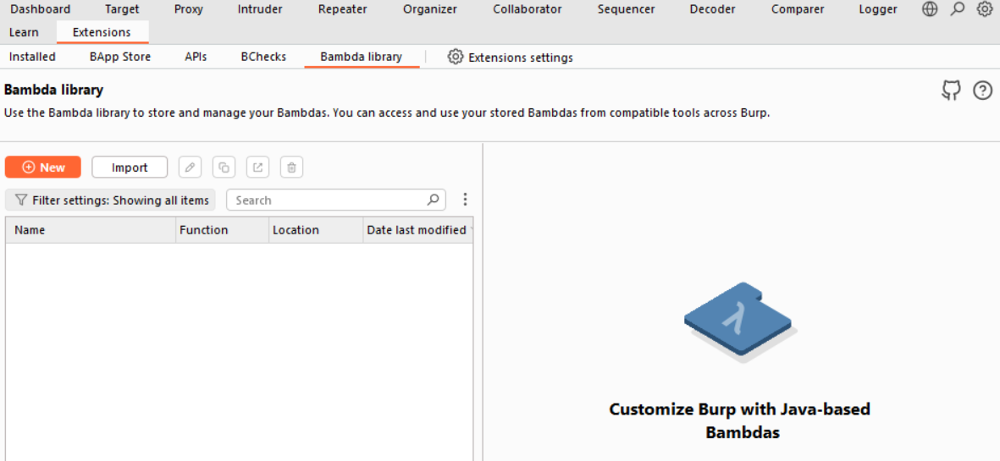
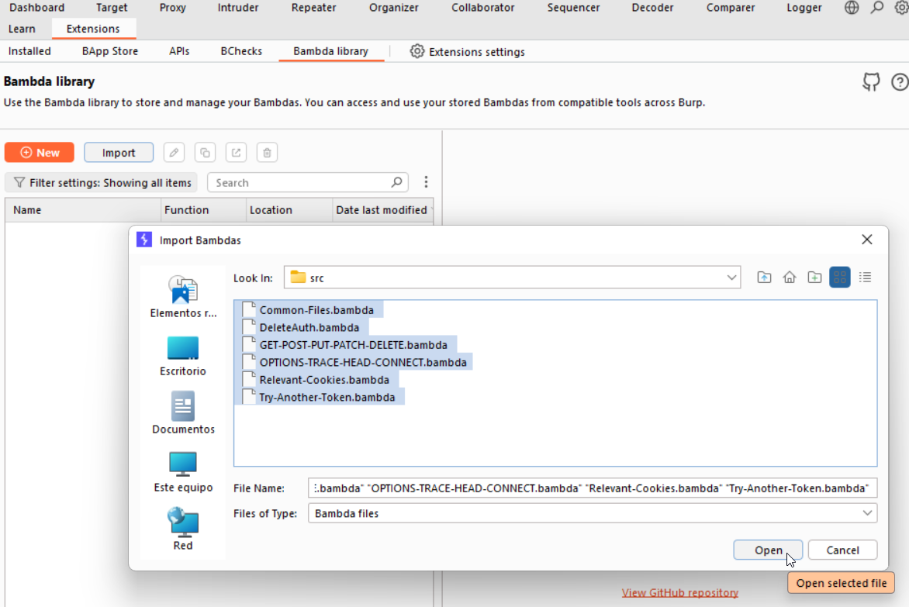
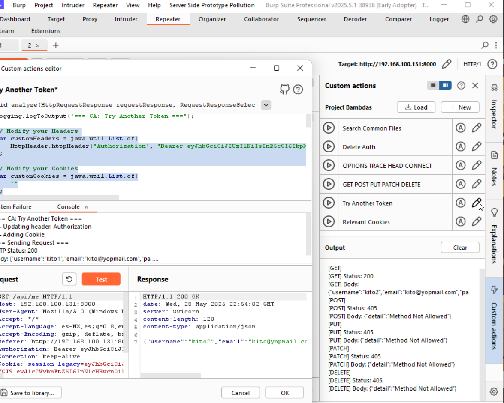

# BurpSuite - Acciones Personalizadas (Custom Actions)

Este repositorio contiene un recopilado de las Custom Actions de BurpSuite que he desarrollado para hacer más eficiente ataques de suplantación de tokens de sesión, uso anónimo, uso de peticiones no documentadas y verificación de archivos comunes.

## Descripción de Scripts 

- **Common-Files.bambda**: Verifica la existencia de archivos comunes como `robots.txt` dentro del dominio de la petición actual.
- **Relevant-Cookies.bambda**: Evalúa la relevancia de cada cookie eliminándolas una a una, para determinar cuáles son necesarias para que la petición funcione correctamente.
- **Try-Another-Token.bambda**: Reenvía la petición actual con el token de sesión de otro usuario, modificando únicamente la cabecera o cookie especificada. Útil para probar suplantación de identidad.
- **Selected-String-Analyzer.bambda**: Analiza el texto seleccionado en la respuesta para identificar su posible tipo, como hashes (MD5, SHA1, SHA256, etc.), datos codificados en Base64, UTF-8 o posibles números de tarjeta de crédito (TDC) válidos mediante el algoritmo de Luhn.
- **DeleteAuth.bambda**: Envía la petición sin el token ni cookies, para comprobar si la solicitud puede ejecutarse sin autenticación.
- ⚠️ **GET-POST-PUT-PATCH-DELETE.bambda**: Ejecuta la solicitud con distintos métodos HTTP para descubrir funcionalidades expuestas.  
  ⚠️ **Advertencia**: El uso del método DELETE podría causar cambios irreversibles.
- **OPTIONS-TRACE-HEAD-CONNECT.bambda**: Prueba métodos HTTP menos comunes para descubrir superficies adicionales de ataque.


## Instalación

1. Clona el repositorio de github.
```bash
   git clone https://github.com/marco14850/burp-custom-actions.git
```

2. Abre BurpSuite y ve a: Extensions > Bambda Library.
<p align="center">
  
</p>

3. Haz clic en el botón Import y selecciona todos los archivos en la carpeta /src.
<p align="center">
  
</p>

4. Luego en la pestaña Repeater, ve a Custom Actions > Load y selecciona los archivos de acciones personalizadas.
<p align="center">
  
</p>
<p align="center">
  
</p>

5. Ejecuta las acciones personalizadas desde cualquier solicitud cargada en Repeater.
<p align="center">
  
</p>

6. Si necesitas personalizar valores (como en el script 'Try Another Token'), edita el script directamente desde BurpSuite y reemplaza el token o cookie deseado.
<p align="center">
  
</p>