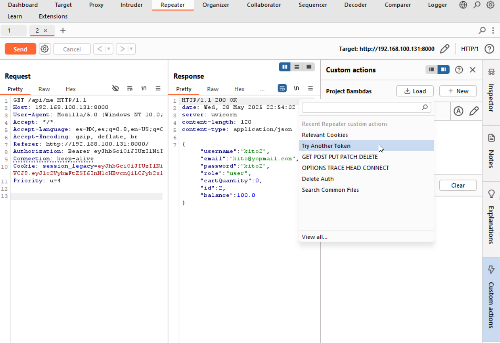

# BurpSuite - Custom Actions

- 🇪🇸 [Leer en Español](README.es.md)

This repository contains a collection of custom BurpSuite actions I’ve developed to improve the efficiency of common testing tasks such as session token impersonation, anonymous usage, undocumented request testing, and discovery of common files.

## Script Descriptions

- **Common-Files.bambda**: Checks for the presence of common files such as `robots.txt` on the current domain.
- **Relevant-Cookies.bambda**: Iteratively removes cookies from the request to determine the minimum set required for the request to function properly.
- **Try-Another-Token.bambda**: Re-sends the current request using another user's session token by modifying a specific header or cookie. Useful for testing token impersonation or session fixation.
- **DeleteAuth.bambda**: Sends the request without authentication tokens or cookies to verify whether access is possible without authentication.
- ⚠️ **GET-POST-PUT-PATCH-DELETE.bambda**: Sends the request using different HTTP methods to identify available functionalities.  
  ⚠️ **Warning**: The DELETE method may trigger irreversible changes if accepted by the server.
- **OPTIONS-TRACE-HEAD-CONNECT.bambda**: Sends the request using less common HTTP methods to identify additional attack surfaces.


## Installation

1. Clone the repository:
   ```bash
   git clone https://github.com/marco14850/burp-custom-actions.git
   ```
2. Open BurpSuite and go to: Extensions > Bambda Library.
<p align="center"> 
    
</p>

3. Click the Import button and select all files from the /src folder.
<p align="center">
     
</p>

4. In the Repeater tab, go to Custom Actions > Load, and import all the custom action files.

<p align="center">
    
</p>
<p align="center">
    
</p>

5. Execute the custom actions from any request within the Repeater tab.
<p align="center">
    
</p>

6. If a script requires customization (e.g., Try Another Token), open it in the editor and manually replace the token or cookie values as needed.
<p align="center">
     
</p>